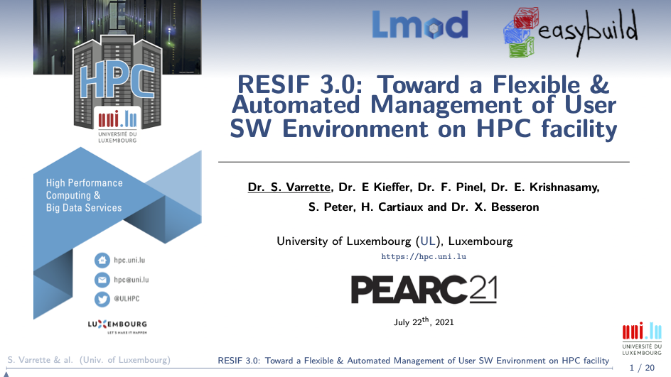

**IMPORTANT: Public export toward this repository IN PROGRESS, some files will be missing until this operation is completed and this banner disappears**

 [](http://www.gnu.org/licenses/gpl-3.0.html) [](https://github.com/ULHPC/sw/issues/) [](https://github.com/ULHPC/sw/) [](https://github.com/ULHPC/sw)

      _   _ _       _   _ ____   ____   ____  _____ ____ ___ _____   _____  ___
     | | | | |     | | | |  _ \ / ___| |  _ \| ____/ ___|_ _|  ___| |___ / / _ \
     | | | | |     | |_| | |_) | |     | |_) |  _| \___ \| || |_      |_ \| | | |
     | |_| | |___  |  _  |  __/| |___  |  _ <| |___ ___) | ||  _|    ___) | |_| |
      \___/|_____| |_| |_|_|    \____| |_| \_\_____|____/___|_|     |____(_)___/

       Copyright (c) 2020-2021 UL HPC Team <hpc-team@uni.lu>

__User Software Management for [Uni.lu HPC](https://hpc.uni.lu) Facility based on the RESIF 3.0 framework__

This is the **Public** repository exposing the main scripts, concepts and documentation facilitating the dissemination of our concepts.

[Accepted paper](https://orbilu.uni.lu/handle/10993/47115) describing RESIF3 concepts and architecture was presented during [ACM PEARC'21](https://pearc.acm.org/pearc21/) [1] -- [doi](https://dl.acm.org/doi/10.1145/3437359.3465600) | [orbilu](https://orbilu.uni.lu/handle/10993/47115)

> [1] S. Varrette, E. Kieffer, F. Pinel, E. Krishnasamy, S. Peter, H. Cartiaux, and X. Besseron, "_RESIF 3.0: Toward a Flexible & Automated Management of User Software Environment on HPC facility_", in ACM Practice and Experience in Advanced Research Computing ([PEARC'21](https://pearc.acm.org/pearc21/)), Virtual Event, 2021.

[](slides/2021/ACM-PEARC21/slides_acm-pearc21-resif3.pdf)


### BibTex entry

      ```bibtex
      @InProceedings{VKPKPCB_PEARC21,
        author =       {S. Varrette and E. Kieffer and F. Pinel and E. Krishnasamy and S. Peter and H. Cartiaux and X. Besseron},
        title =        {{RESIF 3.0: Toward a Flexible & Automated Management of User Software Environment on HPC facility}},
        booktitle =    {ACM Practice and Experience in Advanced Research Computing (PEARC'21)},
        year =         {2021},
        publisher =    {Association for Computing Machinery (ACM)},
        OPTseries =    {{PEARC'21}},
        month =        {July},
        address =      {Virtual Event},
        doi =          {10.1145/3437359.3465600},
        isbn =         {978-1-4503-8292-2/21/07},
        url =          {https://pearc.acm.org/pearc21/},
      },
      ```

## Installation / Repository Setup

To clone this repository, proceed as follows (adapt accordingly):

``` bash
$ mkdir -p ~/git/github.com/ULHPC
$ cd ~/git/github.com/ULHPC
$ git clone https://github.com/ULHPC/sw.git
```

**`/!\ IMPORTANT`**: Once cloned and after following [Preliminaries guidelines](docs/setup.md) (LMod install, virtualenv setup, Github token etc. -- see [`docs/setup.md`](docs/setup.md) and [`docs/contributing/setup-github-integration.md`](docs/contributing/setup-github-integration.md)), initiate your local copy of the repository by running:

``` bash
$ cd ~/git/github.com/ULHPC/sw
$ make setup
```

__Post setup checks (laptop)__

From that point, you should be able to load Easybuild from your laptop, and all the following commands should succeed:

``` bash
### On your laptop
source settings/default.sh
eb --version
eb --show-config
# check that you are able to interact/update the ULHPC fork copy
make fork-easyconfigs-update
# check that you can interact with github
eb --check-github   # All checks PASSed!
```

__Post setup checks (on supercomputer login node)__

When repeating the setup on the cluster, you can check that you are ready if the following commands should succeed:

``` bash
### On iris, this will go on a broadwell node
./scripts/get-interactive-job
source settings/${ULHPC_CLUSTER}.sh
# enable SSH agent
eval "$(ssh-agent)"
ssh-add ~/.ssh/id_rsa

eb --version
eb --show-config
# check that you are able to interact/update the ULHPC fork copy
make fork-easyconfigs-update
# check that you can interact with github
eb --check-github   # ONLY new-pr and update-pr should FAIL
# reason is that most probably you don't want the ssh key on the cluster authorized
# to push on ULHPC fork
eval "$(ssh-agent -k)"  # ONLY new-pr and update-pr should FAIL
# reason is that most probably you don't want the ssh key on the cluster authorized
# to push on ULHPC fork
```

## Documentation

See [`docs/`](docs/README.md).

The documentation for this project is handled by [`mkdocs`](http://www.mkdocs.org/#installation).
You might wish to generate locally the docs:

* Install [`mkdocs`](http://www.mkdocs.org/#installation)
* Preview your documentation from the project root by running `mkdocs serve` and visit with your favorite browser the URL `http://localhost:8000`
     - Alternatively, you can run `make doc` at the root of the repository.
* (eventually) build the full documentation locally (in the `site/` directory) by running `mkdocs build`.

## Software set organizations

See [`docs/swsets.md`](docs/swsets.md).

Software sets holds a categorised list of software, defined as Module [`Bundle`](https://easybuild.readthedocs.io/en/latest/version-specific/generic_easyblocks.html#bundle) for the ULHPC environment holding the dependencies of hierarchical bundles structured under `easyconfigs/u` as follows:

```bash
├── ULHPC/[...]-<version>.eb    #### === Default global bundle for 'regular' nodes ===
│   ├── ULHPC-toolchains/[...]-<version>.eb ### Toolchains, compilers, debuggers, programming languages...
│   ├── ULHPC-bio/[...]-<version>.eb        ### Bioinformatics, biology and biomedical
│   ├── ULHPC-cs/[...]-<version>.eb         ### Computational science, including:
│   └── [...]
└── ULHPC-gpu/[...]-<version>.eb #### === Specific GPU versions compiled under {foss,intel}cuda toolchains ===
```

See [`easyconfigs/u/ULHPC*`](easyconfigs/u/)


A strong versioning policy is enforced, which fix the core component versions of the bundles.


## User Software builds

Slurm launchers are provided under `scripts/`  to facilitate software builds.

**`/!\ IMPORTANT`** RESIF 3 supports 3 operation modes depicted below:

| Operation Mode                       | Architecture    | Launcher script                                                                |
|----------------------                |------------     |----------------------------------------------------------------                |
| Easybuild bootstrap/update           | *               | `setup.sh`                                                                     |
| _Home_/_Testing_ builds              | default         | `[sbatch] ./scripts/[<version>]/launcher-test-build-cpu.sh`                    |
|                                      | CPU non-default | `[sbatch] ./scripts/[<version>]/launcher-test-build-cpu-<arch>.sh`             |
|                                      | GPU optimized   | `[sbatch] ./scripts/[<version>]/launcher-test-build-gpu.sh`                    |
| _Production_ `<version>` builds      | default         | `[sbatch] ./scripts/prod/launcher-resif-prod-build-cpu.sh        -v <version>` |
|                                      | CPU non-default | `[sbatch] ./scripts/prod/launcher-resif-prod-build-cpu-<arch>.sh -v <version>` |
|                                      | GPU optimized   | `[sbatch] ./scripts/prod/launcher-resif-prod-build-gpu.sh        -v <version>` |

**See [`docs/build.md`](docs/build.md) for more details**

_Note_: for convenience, a GNU screen configuration file [`config/screenrc`](config/screenrc) is provided to quickly bootstrap the appropriate tabs:

```bash
screen -c config/screenrc
# 'SW' tab meant for git / sync operations. To enable the ssh agent:
#    eval "$(ssh-agent)"
#    ssh-add ~/.ssh/id_rsa
#    make up
#    make fork-easyconfigs-update
# 'broadwell' tab for associated build. Ex interactive job:
#    ./scripts/get-interactive-job
# 'skylake' tab for associated build. Ex interactive job:
#    ./scripts/get-interactive-job-skylake
# 'gpu' tab for associated build. Ex interactive job:
#    ./scripts/get-interactive-job-gpu
# 'epyc' tab  for aion builds
#    ssh aion
#    ./scripts/get-interactive-job
```

Don't forget to kill your ssh agent when you have finish: `eval "$(ssh-agent -k)"`

In all cases, **production** builds **MUST** be run as `resif` using the launcher scripts under `scripts/prod/*`.
Software and modules will be installed in that case under `/opt/apps/resif` (`$LOCAL_RESIF_ROOT_DIR`) -- See [Technical Docs](https://hpc-docs.uni.lu/environment/modules/#ulhpc-modulepath).
You **MUST BE VERY CAREFUL** when running these scripts as they alter the production environment.

The final organizations of the software and modules is depicted below:


## Workflow and ULHPC Bundle Development guidelines

You first need to review the expected [Git workflow](docs/contributing/git-flow.md)


To add a new software to one of the ULHPC bundle module, you need to find and eventually adapt an existing Easyconfig file. Searching such files can be done using either `eb -S <pattern>`, or via the provided script [`./scripts/suggest-easyconfigs [-v <version>] <pattern>`](scripts/suggest-easyconfigs) which

1. search for Easyconfigs matching the proposed pattern, sorted by increasing version (`sort -V`)
2. check among those easyconfigs is any would be available for the target toolchain as that's probably the one you should use
3. suggest a single easyconfig to try (most recent version)

Example:
``` bash
$> ./scripts/suggest-easyconfigs -h
$> ./scripts/suggest-easyconfigs PAPI
=> Searching Easyconfigs matching pattern 'PAPI'
PAPI-5.4.3-foss-2016a.eb
PAPI-5.5.1-GCCcore-6.3.0.eb
PAPI-5.5.1-GCCcore-6.4.0.eb
PAPI-5.6.0-GCCcore-6.4.0.eb
PAPI-5.7.0-GCCcore-7.3.0.eb
PAPI-5.7.0-GCCcore-8.2.0.eb
PAPI-6.0.0-GCCcore-8.3.0.eb
Total:        7 entries

... potential exact match for 2019b toolchain
PAPI-6.0.0-GCCcore-8.3.0.eb
 --> suggesting 'PAPI-6.0.0-GCCcore-8.3.0.eb'
```

See also [`docs/workflow.md`](docs/workflow.md) for more details.

## Submitting working Easyconfigs to easybuilders

See [`docs/contributing/`](docs/contributing/README.md)

To limit the explosion of custom easyconfigs as was done in the past, the key objective of this project is to **minimize** the number of custom easyconfigs to the _strict_ minimum and thus to submit a maximum of easyconfigs to the community for integration in the official [`easybuilders/easybuild-easyconfigs`](https://github.com/easybuilders/easybuild-easyconfigs) repository.
A set of helper scripts are provided to facilitate this operation -- Typical workflow:

```bash
# Creating a new pull requests (typically ion your laptop)
./scripts/PR-create -n easyconfigs/<letter>/<software>/<filename>.eb    # Dry-run
./scripts/PR-create easyconfigs/<letter>/<software>/<filename>.eb
# Complete it with a successfull test report ON IRIS/AION
sbatch ./scripts/PR-rebuild-upload-test-report.sh <ID>

# (eventually) Update/complete the pull-request with new version/additional EB files
eb --update-pr <ID> <file>.eb --pr-commit-msg "<message>" # use native easybuild command here
#  Update your local easyconfigs from remote PR commits
./scripts/update-from-PR [-n] <ID>

# Repo cleanup upon merged pull-request
./scripts/PR-close [-n] <ID>
```

## Issues / Feature request

You can submit bug / issues / feature request using the [`ULHPC/sw` Project Tracker](https://github.com/ULHPC/sw/issues)
