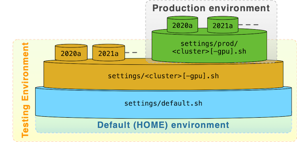

# Easybuild Framework @ ULHPC

* __Resources__:
    - RESIF v2 notes: see `docs/software/user_software_environment/resif_iris/README.first.md`
    - [CSCS Easybuild Environment](https://www.cscs.ch/fileadmin/user_upload/contents_userLab/building_software_piz_daint.pdf)
    - [Historical notes and concept overview (slides)](slides_resif3_overview.pdf)

[](slides_resif3_overview.pdf)

## Architecture-at-a-glance

All settings are embedded in the files provided under `settings/` that you need to source depending on the context:

```bash
# On your laptop
source settings/default.sh

### Testing builds (project sw)
# On iris
source settings/[<version>/]iris.sh          # On broadwell or skylake node ('-C broadwell|skylake')
source settings/[<version>/]iris-gpu.sh      # On GPU node ('-p gpu -G 1')
# On aion
source settings/[<version>/]aion.sh

### Production builds (resif user)
# On iris
source settings/prod/[<version>/]iris.sh          # On broadwell node ('-C broadwell|skylake')
source settings/prod/[<version>/]iris-gpu.sh      # On GPU node ('-p gpu -G 1')
# On aion
source settings/prod/[<version>/]aion.sh
```
The hierarchical organization is inspired Puppet hiera and Ansible variable structure as depicted below




### Global root path `${RESIF_ROOT_DIR}`

* Single repository `ULHPC/sw`
    - hosted on internal Gitlab instance for daily management, selected portion publicly made public on Github ([`ULHPC/sw`](https://github.com/ULHPC/sw))
* The global path for RESIF-related folder will be will be **`${[LOCAL_]RESIF_ROOT_DIR}/<cluster>`**
    - Ex (close to current situation): `/opt/apps/resif/<cluster>` (under GPFS)

| Context                  | __`$RESIF_ROOT_DIR`__     | Activation                      |
|--------------------------|---------------------------|---------------------------------|
| local laptop             | `<path/to/repo>/apps`     | `source settings/default.sh`    |
| Tests PoC `iris` cluster | `/work/projects/sw/resif` | `source settings/iris[-gpu].sh` |
| Tests PoC `aion` cluster | `/work/projects/sw/resif` | `source settings/aion.sh`       |
| Production `iris/aion`   | `/opt/apps/resif`         |                                 |

This lead to the software module organization explained in the [ULHPC Technical Documentation](https://hpc-docs.uni.lu/environment/modules/#module-naming-schemes)

[](https://hpc-docs.uni.lu/environment/images/ULHPC-software-stack.pdf)


### EasyBuild software and modules `$EASYBUILD_PREFIX`

* The EasyBuild software and modules installation (**`$EASYBUILD_PREFIX`**) (see [official documentation](https://easybuild.readthedocs.io/en/latest/Configuration.html#prefix))
   - `iris` cluster: **`${RESIF_ROOT_DIR}/iris/<environment>/{broadwell,skylake,gpu}`**
       * symlink `default -> broadwell`
   - `aion` cluster: **`${RESIF_ROOT_DIR}/aion/<environment>/epyc`**
       * symlink `default -> epyc`
   - `<environment>` is to adapt from past conventions
       * `local` for local tests (project `sw`)
       * `2019b,2020a,2021a` etc. for the corresponding **stable** releases (indexed by the default toolchain version) - this replaces the previous `production` environment even if we'll likely keep the symlinks (`stable` etc.) as before.

### Easybuild Source path `$EASYBUILD_SOURCEPATH`

* Installations kits and source files (see [documentation](https://easybuild.readthedocs.io/en/latest/Configuration.html#sourcepath)), i.e. the parent path of the directory in which EasyBuild looks for software source and install.
The following directory are searched (in this order):

| Order | Path                                | Description                                        |
|-------|-------------------------------------|----------------------------------------------------|
|    1. | `${[LOCAL_]RESIF_ROOT_DIR}/sources` | 'temporary' _common_ sources for all clusters/arch |
|    2. | `${EASYBUILD_PREFIX}/sources`       | specialized sources for the cluster/arch           |
|    3. | `<repo>/sources`                    | **GIT-LFS** sources as part of the repository      |
|    4. | `/opt/apps/sources`                 | previously downloaded sources on `iris`            |

**`/!\ IMPORTANT`** the `sources/` directory of this repository is configured to use the [git-lfs](https://git-lfs.github.com/) (Git Large File Storage (LFS)  extension (see `.gitattributes`).
Ensure you pulled at least once the commits files (you will have to it only once).

```bash
# Once git-lfs extension installed,
make setup-git-lfs     # actually part of 'make setup'
# OR
git-lfs pull
```

See also [`layout.md`](layout.md)


### Searching for Easyconfigs `$EASYBUILD_ROBOT_PATHS`

See [official documentation](https://easybuild.readthedocs.io/en/latest/Using_the_EasyBuild_command_line.html#searching-for-easyconfigs-the-robot-search-path)

> For each dependency that does not have a matching module installed yet, EasyBuild requires a corresponding easyconfig file. If no such easyconfig file was specified on the eb command line, the dependency resolution mechanism will try to locate one in the _robot search path_.

See also [Controlling the robot search path](https://easybuild.readthedocs.io/en/latest/Using_the_EasyBuild_command_line.html#controlling-the-robot-search-path)

Here the following paths are searched (**in this order**)

| Order | Path                                                                 | Description                                                                                                      |
|-------|----------------------------------------------------------------------|------------------------------------------------------------------------------------------------------------------|
|    1. | `<repo>/easyconfigs`                                                 | Custom ULHPC easyconfigs of this repository                                                                      |
|    2. | `${DEFAULT_ROBOT_PATHS}`                                             | Default path from **loaded** `tools/EasyBuild` module                                                            |
|    3. | `~/git/github.com/ULHPC/easybuild-easyconfigs/easybuild/easyconfigs` | ULHPC Fork copy of [`easybuilders/easybuild-easyconfigs`](https://github.com/easybuilders/easybuild-easyconfigs) |

In particular, thank to the last checked directory (cloned directory hosting the forked copy of the official [easyconfigs]() repository, in the `develop` branch), we are sure to use the up-to-date easyconfigs recipY.
It is thus **important** to keep the repository up-to-date with the latest commits, from either the `origin` remote (pointing to the [ULHPC fork](https://github.com/ULHPC/easybuild-easyconfigs), or the `upstream` remote (pointing to he official [`easybuilders/easybuild-easyconfigs`](https://github.com/easybuilders/easybuild-easyconfigs) repository.
This is facilitated by the following command:

```bash
make fork-easyconfigs-update
```
See also [`setup.md`](setup.md)


## UL HPC Module Bundles

We no longer require YAML files in a separate repository to define a software set.
The idea is now to rely on native Easybuild Module bundles _i.e.,_ using the [`Bundle`](https://easybuild.readthedocs.io/en/latest/version-specific/generic_easyblocks.html#bundle) easyblocks.

For more details, see [`swsets/README.md`](swsets/index.md)

## UL HPC Software Builds

Slurm launchers are provided under `./scripts/launcher-resif-build-*`.
Investigations in progress to deeply accelerate the global software set builds by a clever construction of Slurm job dependencies based on a _dominance tree_ structure.

See [`build.md`](build.md) for more details.

## Development workflow

See [`workflow.md`](workflow.md)

## Hooks

To drastically reduce the number of custom EasyBuilds and to prevent any future divergence from streamline developments, most of the customization is outsourced through [special hooks](https://easybuild.readthedocs.io/en/latest/Hooks.html) which are in fact python callback functions that can be called during the different execution steps of Easybuilds. See `eb --avail-hooks` for available hooks.

We selected the `parse_hook` function to inject on the fly extras parameters in the loaded easyconfig before their processing to simulate changes embedded in the original easyconfigs files. It permits to handle transparently installation keys and license definitions within the generated modules, when those settings are inherently specific to our site and are not meant to be exposed.

For more details, see `hooks/ulhpc.py`


## Contributions to official Easyconfigs

See [`contributing/`](contributing/index.md)
