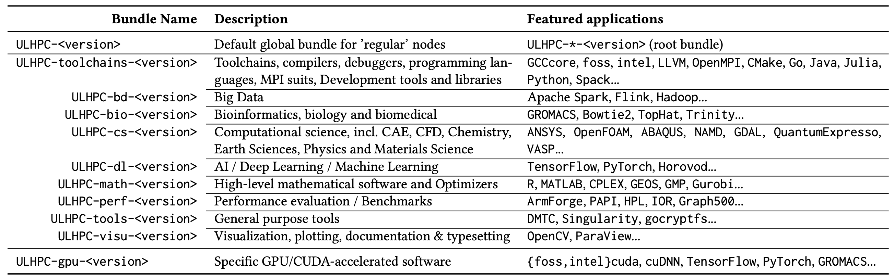

# Software Sets

Software sets holds a categorised list of software.
In RESIF2, this notion was tied to a YAML file listing the EB files that should be built from a given environment (see for instance `swsets/default.yaml` under (deprecated) `ULHPC/resifconfig` repository)

To get rid of these YAML files while relying exclusively on Easybuild, this repository maintain a set of easyconfigs defining Module bundles (i.e. using the [`Bundle`](https://easybuild.readthedocs.io/en/latest/version-specific/generic_easyblocks.html#bundle) easyblock, or the [`Toolchain`](https://easybuild.readthedocs.io/en/latest/version-specific/generic_easyblocks.html#toolchain) one (derived from the Bundle one) for the ULHPC environment.
This defines a bundle of modules, which only generate module files, nothing to build/install.

It also facilitates the _reproducible_ and _self-contained_ deployment of the complete software stack, coupled with a strong versioning policy between environments and (typically) yearly release cycles based on EasyBuild toolchain releases.

## ULHPC Toolchains, programming languages and compilers

**[Technical Documentation](https://hpc-docs.uni.lu/environment/modules/#ulhpc-toolchains-and-software-set-versioning)**

| __Name__  | __Type__  | 2019(a) (_deprecated_)  |  __2019b__ (`old`) |  __2020a__ (`prod`) | __2021a*__ (`devel`) |
|-----------|-----------|------------------------|--------------------|---------------------|----------------------|
| `GCCCore` | compiler  |                  8.2.0 |              8.3.0 |               9.3.0 |               10.3.0 |
| `foss`    | toolchain |                  2019a |              2019b |               2020a |                2021a |
| `intel`   | toolchain |                  2019a |              2019b |               2020a |                2021a |
| binutils  |           |                 2.31.1 |               2.32 |                2.34 |                 2.36 |
| Python    |           |     3.7.2 (and 2.7.15) | 3.7.4 (and 2.7.16) | 3.8.2  (and 2.7.18) |                3.9.2 |
| LLVM      | compiler  |                  8.0.0 |              9.0.1 |              10.0.1 |               11.1.0 |
| OpenMPI   | MPI       |                  3.1.4 |              3.1.4 |               4.0.3 |                4.1.1 |

_*: projections at the time of writing _

ULHPC software set are aligned with the common toolchains releases of EasyBuild (see Component versions in the  [foss](https://easybuild.readthedocs.io/en/master/Common-toolchains.html#component-versions-in-foss-toolchain) and the [intel](https://easybuild.readthedocs.io/en/master/Common-toolchains.html#component-versions-in-intel-toolchain) toolchains )

These versions define completely the environment set for ULHPC software set, structured as bundles as explained below.


## ULHPC Bundles

The dependencies for User Software Set are organized as follows:



In details, under `easyconfigs/u`, you will find the following directory/file structure:

```bash
easyconfigs/u
  ├── ULHPC                 #### === Default global bundle for 'regular' nodes ===
  │   └── ULHPC-<version>
  |
  ├── ULHPC-toolchains      ### Toolchains, compilers, debuggers, programming languages...
  │   └── ULHPC-toolchains-<version>.eb #  - toolchain: EasyBuild toolchains
  │                                     #  - compiler:  Compilers
  │                                     #  - debugger:  Debuggers
  │                                     #  - devel:     Development tools
  │                                     #  - lang:      Languages and programming aids
  │                                     #  - mpi:       MPI stacks
  │                                     #  - lib:       General purpose libraries (incl. Communication Libraries, I/O Libraries...)
  │                                     #  - numlib:    Numerical Libraries
  │                                     #  - system:    System utilities (e.g. highly depending on system OS and hardware)
  ├── ULHPC-bd               ### Big Data Analytics
  │   └── ULHPC-bd-<version>.eb
  ├── ULHPC-bio              ### Bioinformatics, biology and biomedical
  │   └── ULHPC-bio-<version>.eb
  ├── ULHPC-cs               ### Computational science, including:
  │   └── ULHPC-cs-<version>.eb         #   - cae:       Computer Aided Engineering (incl. CFD)
  │                                     #   - chem:      Chemistry, Computational Chemistry and Quantum Chemistry
  │                                     #   - data:      Data management & processing tools
  │                                     #   - geo:       Earth Sciences
  │                                     #   - quantum:   Quantum Computing
  │                                     #   - phys: Physics and physical systems simulations
  ├── ULHPC-dl               ### AI / Deep Learning / Machine Learning
  │   └── ULHPC-dl-<version>.eb
  ├── ULHPC-math             ### High-level mathematical software
  │   └── ULHPC-math-<version>.eb
  ├── ULHPC-perf             ### Performance evaluation / Benchmarks
  │   └── ULHPC-perf-<version>.eb
  ├── ULHPC-tools            ### Misc general purpose tools
  │   └── ULHPC-tools-<version>.eb      # - perf:      Performance tools
  ├── ULHPC-visu             ### Visualization, plotting, documentation and typesetting
  │   └── ULHPC-visu-<version>.eb
  │
  └── ULHPC-gpu    #### === Specific GPU versions ===
      └── ULHPC-gpu-<version>.eb
```

They actually inherits  and aggregate from the default [module classes](https://easybuild.readthedocs.io/en/latest/Writing_easyconfig_files.html#module-class):

```bash
eb --show-default-moduleclasses
Default available module classes:

        base:      Default module class
        astro:     Astronomy, Astrophysics and Cosmology
        bio:       Bioinformatics, biology and biomedical
        cae:       Computer Aided Engineering (incl. CFD)
        chem:      Chemistry, Computational Chemistry and Quantum Chemistry
        compiler:  Compilers
        data:      Data management & processing tools
        debugger:  Debuggers
        devel:     Development tools
        geo:       Earth Sciences
        ide:       Integrated Development Environments (e.g. editors)
        lang:      Languages and programming aids
        lib:       General purpose libraries
        math:      High-level mathematical software
        mpi:       MPI stacks
        numlib:    Numerical Libraries
        perf:      Performance tools
        quantum:   Quantum Computing
        phys:      Physics and physical systems simulations
        system:    System utilities (e.g. highly depending on system OS and hardware)
        toolchain: EasyBuild toolchains
        tools:     General purpose tools
        vis:       Visualization, plotting, documentation and typesetting
```
