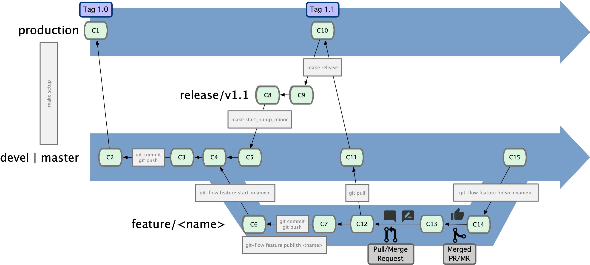

# Workflow: ULHPC Bundle developments

ULHPC software sets was released using RESIF v2 up to Nov 2019, and were based at that time on the 2019a toolchain.
The workflow proved to be quite complex and hard to maintain.
Furthermore, the broken compliance with streamline EasyBuild developments led to an explosion
of custom configurations. With the advent of a new supercomputer (named Aion) featuring a different CPU architecture (AMD Epyc instead of Intel Broadwell/Skylake), and to mitigate the identified limitations, a complete code refactoring was initiated leading to the RESIF 3.0 framework

The validation of the RESIF v3 workflow was proposed on **2019b** toolchain (since 2020a was not yet released at the time of these developments), with the objective to import the complete software set onto up-to-date versions matching 2019b requirements.
RESIF 3 is further used to generate the 2020a and so forth releases

The below guildelines illustrates the import of the software `<name>` into one of the ULHPC bundle. Remember that if possible, all software were proposed in the past for _both_ the `foss[cuda]` and the `intel[cuda]` toolchains. This should still guide the development process.

**You're should ALWAYS work in a feature branch (published) and not directly into `devel`**

```bash
git-flow feature start <name|version>
# publish it to make your collaborators aware of your work on <name>
git-flow feature publish <name|version>
```

The [ULHPC] Git workflow is actually more complex and detailed in [`contributing/git-workflow.md`](contributing/git-workflow.md):

[](contributing/ULHPC-git-workflow.png)


## Remote vs. Local developments

It's probably more comfortable to develop the ULHPC bundles from your laptop. Yet as the builds and tests should intervene on a remote cluster, the following approaches are offered to you (pick-up your favorite one or a mix of them depending on the context/your taste)

* __Edit your files remotely__, either using `vim` within a remote screen session over SSH, or by _mounting with [sshfs](https://github.com/libfuse/sshfs) your remote homedir_ to use your favorite editor **locally** within the mounted directory (see [tutorial](https://support.nesi.org.nz/hc/en-gb/articles/360000621135-Can-I-use-SSHFS-to-mount-the-cluster-filesystem-on-my-local-machine-)).
    - the same can be achieved **without** `sshfs` with your *local* Emacs which allows to transparently edit _remote_ files via [Tramp](https://www.gnu.org/software/tramp/) ("Transparent Remote (file) Access, Multiple Protocol")
    - As the changes will be performed _remotely_, you will need to commit them _from the remote cluster_ (i.e. interacting to the repository via your cluster SSH key which should thus be granted write access to all repositories)
         * thus beware of having correctly configured your git `user.{name,email}` settings
    - no extra cleanup is necessary remotely as your working copy on the cluster will become your "source of authority" for all changes
         * _on your laptop_, you just need to pull the changes when necessary

* __Edit your files locally__ using your favorite editor and keep your remote directory on the cluster synchronized using  `rsync`. you **SHOULD** then  use the GNU Make directives defined in `.Makefile.local` (internal repo **only**) to facilitate this step for you using the appropriate `--exclude` options.
    - use `make sync` for that purpose (`rsync -avz --update [...]`)
       * use `make sync-delete` for a more aggressive synchronization (`rsync -avz --delete [...]`)
    - you have to perform this synchronization prior to any tests
    - As the changes will be performed _locally_, you will need to commit them _from your laptop_ (i.e. interacting to the repository via your private SSH key)
    - Extra cleanup is necessary remotely before pulling as your remote working copy on the cluster will be dirty from temporary modified files / not yet known files that will conflict with commits bringing these files. This involves:
         * checkout the modified files known to git to the last committed version
         * remove the new files not known to git

Example of the cleanup operation is proposed below

```bash
# Only on iris, if dirty remote directory before pulling your local commits
git status
# restore modified files to last commited version
# /!\ this will DISCARD PERMANENTLY all changes, which will be lost
git status | grep modified
git status | grep modified | awk '{ print $3 }' | xargs git checkout
# remove non-tracked files
rm [...]
# Now you can pull
git pull
# ... and probably update the ULHPC/easybuild-easyconfigs repository
make fork-easyconfigs-update
```

## Preparing a new Bundle

You should start with the **previous** stable bundle and adapt from it with the appropriate versions of the software listed.
**ALWAYS start with the toolchains bundle**

### Copy and adapt from the last stable bundle

Ex: to prepare the 2020b version from 2020a:

```bash
cd path/to/sw
make up
make fork-easyconfigs-update     # Always keep up to date the latests configs
git-flow feature start <version> # In this case: <version>=2020b
cd easyconfigs/u/ULHPC-toolchains
cp ULHPC-toolchains-2020a.eb ULHPC-toolchains-2020b.eb # ADAPT accordingly
```

Then you should adapt all the `local_` variables with the appropriate versions:

```bash
# /!\ ADAPT <version> accordingly
$ ./scripts/suggest-easyconfigs -v <version> -s GCC binutils Python LLVM
# In this case:
$ ./scripts/suggest-easyconfigs -v 2020b -s GCC binutils Python LLVM
               GCC: GCC-10.2.0.eb
          binutils: binutils-2.35-GCCcore-10.2.0.eb
            Python: Python-3.8.6-GCCcore-10.2.0.eb
              LLVM: LLVM-11.0.0-GCCcore-10.2.0.eb
```

Then make a quick and dirty check of the _probable_ good versions of each software listed in the bundle as follows:

```bash
# Extract space-separated list of the software listed as dependencies
# /!\ ADAPT <version> accordingly
$ cat easyconfigs/u/ULHPC-toolchains/ULHPC-toolchains-<version>.eb| egrep "\s+\('" | cut -d "'" -f 2 | uniq | xargs echo
# ... and use it in summary mode (-s) with ./scripts/suggest-easyconfigs -v <version> -s [...]
# Ex for 2020b
bundle=toolchains; version=2020b; ./scripts/suggest-easyconfigs -v $version -s $(cat easyconfigs/u/ULHPC-${bundle}/ULHPC-${bundle}-${version}.eb| egrep "\s+\('" | cut -d "'" -f 2 | uniq | xargs echo)

           GCCcore: GCCcore-10.2.0.eb
              foss: foss-2020b.eb
             intel: intel-2020b.eb
              LLVM: LLVM-11.0.0-GCCcore-10.2.0.eb
             Clang: Clang-11.0.1-gcccuda-2020b.eb
              NASM: NASM-2.15.05-GCCcore-10.2.0.eb
             CMake: CMake-3.18.4-GCCcore-10.2.0.eb
           Doxygen: Doxygen-1.8.20-GCCcore-10.2.0.eb
           ReFrame: ReFrame-3.6.3.eb
             Spack: Spack-0.12.1.eb
           OpenMPI: OpenMPI-4.1.0-GCC-10.2.0.eb
                Go: Go-1.16.6.eb
              Java: Java-16.0.1.eb
             Julia: Julia-1.6.2-linux-x86_64.eb
              Perl: Perl-5.32.0-GCCcore-10.2.0-minimal.eb
            Python: Python-3.8.6-GCCcore-10.2.0.eb
              Ruby: Ruby-2.7.2-GCCcore-10.2.0.eb
              Rust: Rust-1.52.1-GCCcore-10.3.0.eb
                 R: R-keras-2.4.0-foss-2020b-R-4.0.4.eb
             Boost: Boost.Python-1.74.0-GCC-10.2.0.eb
              SWIG: SWIG-4.0.2-GCCcore-10.2.0.eb
               ant: ant-1.10.9-Java-11.eb
               tbb: tbb-2020.3-GCCcore-10.2.0.eb
        sparsehash: sparsehash-2.0.4-GCCcore-10.2.0.eb
             Spark: Spark-3.1.1-fosscuda-2020b.eb
         Anaconda3: Anaconda3-2021.05.eb
               GDB: GDB-10.1-GCCcore-10.2.0.eb
          Valgrind: Valgrind-3.16.1-gompi-2020b.eb
```
It's far from being perfect but it can help to provide a good **draft** version of the bundle you can work on. When in doubt, check the list of easyconfigs with `./scripts/suggest-easyconfigs -v <version> <pattern>`. Example:

```bash
version=2020b
./scripts/suggest-easyconfigs -v ${version} R-4 Boost Spark Anaconda3 Valgrind
```

### Lint-check the bundle style

Use `eb --check-contrib <ebfile>` to check the correct parsing and dependency checks.
Ex:

```bash
bundle=toolchains; version=2020b; eb --check-contrib ./easyconfigs/u/ULHPC-${bundle}/ULHPC-${bundle}-${version}.eb
```

### Comment out potential problematic and test builds

Some software (and their dependencies) like OpenMPI will deserve a special attention so it's better at this stage to comment out them.
Then

1. Make a testing Builds (project `sw`), probably against the 2020b environment:

```bash
# Interactive tests
./scripts/get-interactive-job
source settings/2020b/aion.sh
echo $EASYBUILD_PREFIX
# OR... with passive jobs
sbatch ./scripts/2020b/launcher-test-build-amd.sh -D toolchains
sbatch ./scripts/2020b/launcher-test-build-amd.sh toolchains
```

   Repeat until the bundle is complete
2. Once completed, make a production build

See [`build.md`](build.md) for more details.


## Finding existing easyconfigs

```bash
make up
make fork-easyconfigs-update  # ensure you get latest easyconfigs
source setting/<cluster>[-gpu].sh    # Adapt accordingly
eb -S <pattern>
./scripts/suggest-easyconfigs [-v <version>] <pattern>
```

To add a new software to one of the ULHPC bundle module, you need to find and eventually adapt an existing Easyconfig file. Searching such files can be done using either `eb -S <pattern>`, or via the provided script `./scripts/suggest-easyconfigs <pattern>` which

1. search for Easyconfigs matching the proposed pattern, sorted by increasing version (`sort -V`)
2. check among those easyconfigs is any would be available for the current toolchain (2019b) as that's probably the one you should use
3. suggest a single easyconfig to try (most recent version)

You will be confronted to the following cases.

* __An existing easyconfigs exists in the official repository for the target toolchain version__
    - You're lucky but this is very likely to happen (and justify to rely on [streamline Easyconfigs](https://github.com/easybuilders/easybuild-easyconfigs/tree/develop))
    - Typical Example:
        * `CMake-3.15.3-GCCcore-8.3.0.eb`: depends on GCCcore, thus common to both `foss` and `intel`. The same happens with `GCC`
        * `Go-1.14.1.eb` (no dependency on any toolchain)
        * `Boost-1.71.0-{gompi,iimpi}-2019b.eb`, derived toolchains, compliant with `foss` (resp. `intel`) ones;
        * `GDAL-3.0.2-{foss,intel}-2019b-Python-3.7.4.eb`
   - Note that in **very rare** cases (Ex: OpenMPI), you will still need to provide a custom version (inspired from the official one) to benefit from _local_ settings (such as Slurm bindings in the case of MPI suits) and aimed to stand as custom easyconfigs under this repository.

* __None (or only very old/obsolete) easyconfigs are suggested__
    - Don't panic, it simply means that the  **official** repositories do not hold any recent reciPY for the considered software.
    - You _may_ find a more recent version which were used in the past software set as part of the (deprecated) **private/custom** `ULHPC/easyconfigs` repository
    - You _may_ find a __pending [Pull-request](https://github.com/easybuilders/easybuild-easyconfigs/pulls)__ addressing the software you're looking for
    - In all cases: you can prepare an easyconfig in the local repository and prepare for the adaptation to the new toolchain version
    - **BEWARE** to delegate customization to hooks if you can to the hook!
        * see `hooks/ulhpc.py`

* __A very recent easyconfig exists but prior to the considered toolchain__ (Ex: 2019a)
    - Use `eb -S <name>-[...]` to find the complete path to the easyconfig file
    - copy it to the appropriate place within this repository i.e. `easyconfigs/<letter>/<name>`
    - **BEWARE** to delegate customization to hooks if you can
        * see `hooks/ulhpc.py`

```bash
mkdir -p easyconfigs/<letter>/<name>
# Case 3: inspire from official repo
eb -S <name>-<version>    # get complete path to the target easyconfig
CFGS1=[...]   # Define suggested variable
cp $CFGS1/<name>-<version>[...].eb easyconfigs/<letter>/<name>
cd easyconfigs/<letter>/<name>
# Eventually -- diff with past custom EB present in ULHPC/easyconfigs private repo on Gitlab
colordiff <name>-<version>[...].eb ~/git/gitlab.uni.lu/ULHPC/easyconfigs/[...].eb
# Now prepare for adapting filename and content of easyconfig to match target toolchain
mv <name>-<version>[...].eb <name>-[...].eb
```

## Adapting a past Easyconfig

* (_eventually_) Check on the website for the most up-to-date version of the software released
* Adapt the filename of the copied easyconfig to match the target version / toolchain
   - Ex: `mv GDB-8.3-GCCcore-8.2.0-Python-3.7.2.eb GDB-9.1-GCCcore-8.3.0-Python-3.7.4.eb`
* Edit the content of the easyconfig
   - You'll typically have to adapt the version of the dependencies and the checksum(s) to match the static versions set for the target toolchain, enforce https urls etc.

(complex) Example:

```diff
--- g/GDB/GDB-8.3-GCCcore-8.2.0-Python-3.7.2.eb	2020-03-31 12:17:03.000000000 +0200
+++ g/GDB/GDB-9.1-GCCcore-8.3.0-Python-3.7.4.eb	2020-05-08 15:49:41.000000000 +0200
@@ -1,31 +1,36 @@
 easyblock = 'ConfigureMake'

 name = 'GDB'
-version = '8.3'
+version = '9.1'
 versionsuffix = '-Python-%(pyver)s'

-homepage = 'http://www.gnu.org/software/gdb/gdb.html'
+homepage = 'https://www.gnu.org/software/gdb/gdb.html'
 description = "The GNU Project Debugger"

-toolchain = {'name': 'GCCcore', 'version': '8.2.0'}
+toolchain = {'name': 'GCCcore', 'version': '8.3.0'}

 source_urls = [GNU_SOURCE]
 sources = [SOURCELOWER_TAR_XZ]
-checksums = ['802f7ee309dcc547d65a68d61ebd6526762d26c3051f52caebe2189ac1ffd72e']
+checksums = ['699e0ec832fdd2f21c8266171ea5bf44024bd05164fdf064e4d10cc4cf0d1737']

 builddependencies = [
-    ('binutils', '2.31.1'),
-    ('texinfo', '6.6'),
+    ('binutils', '2.32'),
+    ('texinfo', '6.7'),
 ]

 dependencies = [
     ('zlib', '1.2.11'),
     ('libreadline', '8.0'),
     ('ncurses', '6.1'),
-    ('expat', '2.2.6'),
-    ('Python', '3.7.2'),
+    ('expat', '2.2.7'),
+    ('Python', '3.7.4'),
 ]

+preconfigopts = "mkdir obj && cd obj && "
+configure_cmd_prefix = '../'
+prebuildopts = "cd obj && "
+preinstallopts = prebuildopts
+
 configopts = '--with-system-zlib --with-python=$EBROOTPYTHON/bin/python --with-expat=$EBROOTEXPAT '
 configopts += '--with-system-readline --enable-tui --enable-plugins --disable-install-libbfd '
```

__Note on dependencies version:__ typically as in the above  example, the version to use for dependencies are not obvious to guess (Ex: `texinfo`, `expat` etc.).
Use `./scripts/suggest-easyconfigs -s <depname1> <depname2>` to find the most suitable choice for the target toolchain (`-s`: summary mode, quickly output only the suggested easyconfig).

```bash
$ ./scripts/suggest-easyconfigs -s expat texinfo zlib libreadline ncurses Python
             expat: expat-2.2.7-GCCcore-8.3.0.eb
           texinfo: texinfo-6.7-GCCcore-8.3.0.eb
              zlib: zlib-1.2.11-GCCcore-8.3.0.eb
       libreadline: libreadline-8.0-GCCcore-8.3.0.eb
           ncurses: ncurses-6.1-GCCcore-8.3.0.eb
            Python: Python-3.7.4-GCCcore-8.3.0.eb
```

## Test the build

```bash
# Eventually on your laptop:
$ make sync
# on iris
# Ex: broadwell interactive build
$ ./scripts/get-interactive-job
$ source settings/iris.sh
$ ./scripts/launcher-test-build-cpu.sh -n [easyconfigs/<letter>/<name>/]<name>[...].eb # Dry-run
$ ./scripts/launcher-test-build-cpu.sh [easyconfigs/<letter>/<name>/]<name>[...].eb
```

If the build succeed, you can commit your new easyconfig (if you had to develop one) and add it to the appropriate ULHPC bundle

## Update the appropriate ULHPC bundle accordingly

Simply add the new software `<name>` to the appropriate bundle as dependency following the [format](https://easybuild.readthedocs.io/en/latest/Writing_easyconfig_files.html#dependencies)

```python
  (<name>, <version>[, <versionsuffix>[, <toolchain>]])
```

You should use the `local_*` variable whenever it is possible to abstract at maximum from the toolchain version and thus facilitate further upgrades (that will likely consist in focusing on the software version).
See the current example as inspiration.

Example:


```python
    ('foss',    version),
    ('intel',   version),
    ('LLVM',   local_llvmver, '', ('GCCcore', local_gccver)),
    ('NASM',   '2.14.02', '', ('GCCcore', local_gccver)),
    ('Boost',  '1.71.0',  '', ('gompi',    version)),
    ('Boost',  '1.71.0',  '', ('iimpi',    version)),
    ('GDB',    '9.1',   '-Python-%(pyver)s', ('GCCcore', local_gccver)),
```

## Commit and merge your changes

```bash
$> git add easyconfigs/u/ULHPC[...]
$> git commit -s -m '[ULHPC] <name> <version>'
# /!\ Open Merge Request (MR) for your feature branch
# [...]
# Once MR merged / approved
$> git-flow feature finish <name>
# check that no more [remote] branch feature/<name> exist
$> git branch -a
```

## Licenses and Keys

For some softwares (ex: [Gurobi](https://www.gurobi.com/),[Matlab](https://fr.mathworks.com/products/matlab.html),[Mathematica](https://www.wolfram.com/mathematica/)), an installation key and a license are necessary. The way license are managed is general specific to the site and should not be handled by the easyconfig.

To cope with this problem, one can rely on **easybuild hooks**. Theses hooks are in fact python callback functions that can be called during the different execution steps of easybuils (see https://easybuild.readthedocs.io/en/latest/Hooks.html). In our case, the `def parse_hook(ec, *args, **kwargs)` function allow us to inject **extras** in the loaded easyconfig before processing.
See ``hooks/ulhpc.py`

```python
import yaml
import os

def parse_hook(ec, *args, **kwargs):
    # Installation key and license section - Use a special YAML file to provide the entries
    # Example can be found in config/custom/licenses_keys.yml.sample
    if os.getenv('LICENSES_YAML_FILE') is not None:
         with open(os.getenv('LICENSES_YAML_FILE')) as f:
                 data = yaml.load(f, Loader=yaml.FullLoader)
                 software = data.get(ec.name,None)
                 if software is not None :
                     print("Installing extras for {0}".format(ec.name))
                     for parameter in software:
                         if isinstance(software[parameter],dict) and software[parameter].get('version',None) is not None:
                             # We have multiple version and this parameter differs
                             ec[parameter]=software[parameter]["version"][ec.version]
                         else:
                             ec[parameter]=software[parameter]

    # Fix individual eb
    if ec.name == 'impi':
        # Slurm Process Management Interface (PMI) library path, as installed by slurm-libpmi RPM package
        slurm_libpmi_path = '/usr/lib64/libpmi.so'
        # ec.log.info("[parse hook] export I_MPI_PMI_LIBRARY=%s for impi module" % slurm_libpmi_path)
        # os.environ['I_MPI_PMI_LIBRARY'] = slurm_libpmi_path
        ec.log.info("[parse hook] Set I_MPI_PMI_LIBRARY to '%s' for impi module as modextravars" % slurm_libpmi_path)
        ec['modextravars'].update({'I_MPI_PMI_LIBRARY': slurm_libpmi_path})
        #ec.log.info(ec.asdict())
        ec['skipsteps'].append('sanitycheck')
    # [...]
```
The hook contains in this file will open a yaml file to verify if some extras are needed to be injected. The location of the yaml is defined with an environment variable **LICENSES_YAML_FILE** that needs to be set before calling easybuild.
In order to use this hooks, the yaml package needs to be installed in your `resif3` virtual environment.
For this purpose, activate first the `resif3` venv and call `pip install PyYAML` (part of `requirements.txt` file so should be fine).

A sample yaml file is provided in `config/custom/licenses_keys.yml.sample`.

Please note that if our software set contains multiple version of a software, an additional key **version** should be added.
Empty parameter should receive the **null** value: Since easybuild is coded in python, the **null** value will be converted to equivalent **none** value in python.
Please also refer to [easyconfig parameters](https://easybuild.readthedocs.io/en/latest/version-specific/easyconfig_parameters.html) to determine the default parameter value expected by easybuild.
Let us see an example of execution:

```bash
export LICENSES_YAML_FILE="/path/to/licenses_keys.yaml"
./scripts/launcher-test-build-cpu.sh ebconfig --hooks=./hooks/license_hooks.py
```
or

```bash
export LICENSES_YAML_FILE="/path/to/licenses_keys.yaml"
export EASYBUILD_HOOKS=$(pwd)/hooks/license_hooks.py
./scripts/launcher-test-build-cpu.sh ebconfig --hooks=./hooks/license_hooks.py
```

_Note_: the hooks settings are enabled by default in `settings/default.sh`
It's thus up to you to set appropriately the `LICENSES_YAML_FILE` variable to point to your site license.

## Contribute to Easybuild

If you developped a new easyconfig, you are expected to contribute it back to the Easybuilders community.
This is required to restrict at maximum the number of _internal_ custom Easyconfigs and one of the difference with the previous workflow.

See [`contributing/`](contributing/) for more details.
