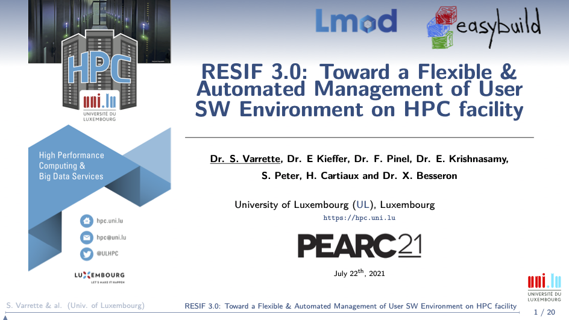

# RESIF 3.0: Toward a Flexible & Automated Management of User Software Environment on HPC facility

Paper submitted and accepted on May 11, 2021 to [ACM PEARC'21](pearc.acm.org/pearc21/call-for-participation/) [1] -- [doi](https://dl.acm.org/doi/10.1145/3437359.3465600) | [orbilu](https://orbilu.uni.lu/handle/10993/47115)

> [1] S. Varrette, E. Kieffer, F. Pinel, E. Krishnasamy, S. Peter, H. Cartiaux, and X. Besseron, "_RESIF 3.0: Toward a Flexible & Automated Management of User Software Environment on HPC facility_", in ACM Practice and Experience in Advanced Research Computing ([PEARC'21](https://pearc.acm.org/pearc21/)), Virtual Event, 2021.

```
@InProceedings{VKPKPCB_PEARC21,
  author =       {S. Varrette and E. Kieffer and F. Pinel and E. Krishnasamy and S. Peter and H. Cartiaux and X. Besseron},
  title =        {{RESIF 3.0: Toward a Flexible & Automated Management of User Software Environment on HPC facility}},
  booktitle =    {ACM Practice and Experience in Advanced Research Computing (PEARC'21)},
  year =         {2021},
  publisher =    {Association for Computing Machinery (ACM)},
  OPTseries =    {{PEARC'21}},
  month =        {July},
  address =      {Virtual Event},
  doi =          {10.1145/3437359.3465600},
  isbn =         {978-1-4503-8292-2/21/07},
  url =          {https://pearc.acm.org/pearc21/},
},
```

Presented on Thursday July 22, 2021 -- see [PEARC'21 program](https://pearc21.pathable.co/meetings/virtual/sG4J9a2mJS7nGqSg2)

[](slides_acm-pearc21-resif3.pdf)
